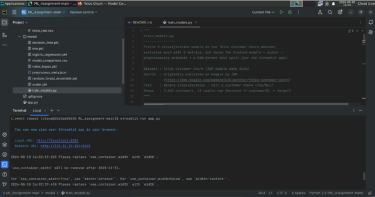
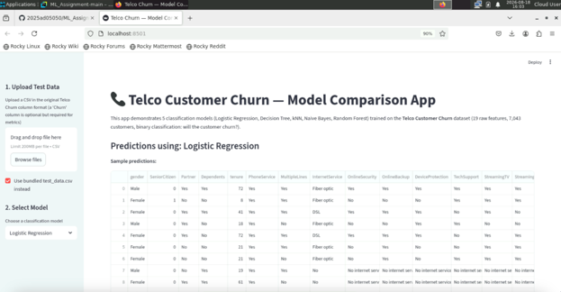

# Telco Customer Churn — Classification Model Comparison

An end-to-end ML project that trains 5 classification models to predict
customer churn for a telecom company, and serves them through an
interactive Streamlit web app.

---

## a. Problem Statement

Customer churn — customers discontinuing a service — is one of the most
expensive problems for subscription-based businesses, since acquiring a
new customer typically costs far more than retaining an existing one.
The goal of this project is to build and compare multiple binary
classification models that predict, from a customer's account and
service usage attributes, **whether that customer is likely to churn
(leave) or not**. Such a model lets a telecom provider proactively target
at-risk customers with retention offers.

---

## b. Dataset Description

- **Name:** Telco Customer Churn
- **Source:** IBM Sample Data Sets, originally published on Kaggle —
  [Telco Customer Churn](https://www.kaggle.com/datasets/blastchar/telco-customer-churn)
- **Instances:** 7,043 customers
- **Raw features:** 19 (after dropping the `customerID` identifier column
  and separating out the target)
  - **Numeric (4):** `SeniorCitizen`, `tenure`, `MonthlyCharges`, `TotalCharges`
  - **Categorical (15):** `gender`, `Partner`, `Dependents`, `PhoneService`,
    `MultipleLines`, `InternetService`, `OnlineSecurity`, `OnlineBackup`,
    `DeviceProtection`, `TechSupport`, `StreamingTV`, `StreamingMovies`,
    `Contract`, `PaperlessBilling`, `PaymentMethod`
- **Target:** `Churn` (Yes / No) — binary classification
- **Class balance:** 5,174 "No" vs. 1,869 "Yes" (~73.5% / 26.5%) — a
  moderately imbalanced dataset, which is realistic for churn problems
  and is deliberately handled below rather than ignored.
- **Preprocessing applied:**
  1. Dropped `customerID` (identifier, not predictive)
  2. Coerced `TotalCharges` to numeric and imputed the ~11 blank values
     (new customers with `tenure = 0`) with the column median
  3. One-hot encoded all 15 categorical columns (`drop_first=True`),
     producing a 30-column model-ready feature matrix
  4. Standardized features (`StandardScaler`) for the two distance/gradient
     -based models (Logistic Regression, kNN); tree-based models used
     unscaled features
  5. Stratified 80/20 train-test split (`random_state=42`) so the class
     ratio is preserved in both splits
  6. `class_weight="balanced"` used for Logistic Regression, Decision Tree,
     and Random Forest to counter the class imbalance instead of letting
     models default to always predicting the majority class

---

## c. GitHub Repository Link

> [ML Assignment Repo URL](https://github.com/2025ad05050/ML_Assignment)

Repository contains: `app.py`, `requirements.txt`, `README.md`,
`test_data.csv`, and the `model/` folder with all training code and
saved model artifacts.

---

## d. Models Used

### Comparison Table

| ML Model Name            | Accuracy | AUC    | Precision | Recall | F1     | MCC    |
|--------------------------|----------|--------|-----------|--------|--------|--------|
| Logistic Regression      | 0.7388   | 0.8412 | 0.5052    | 0.7807 | 0.6134 | 0.4528 |
| Decision Tree            | 0.7381   | 0.8256 | 0.5041    | 0.8182 | 0.6239 | 0.4703 |
| kNN                      | 0.7700   | 0.8084 | 0.5706    | 0.5401 | 0.5549 | 0.4004 |
| Naive Bayes              | 0.6558   | 0.8096 | 0.4269    | 0.8663 | 0.5719 | 0.3951 |
| Random Forest (Ensemble) | 0.7658   | 0.8409 | 0.5440    | 0.7273 | 0.6224 | 0.4679 |

*(Metrics computed on the held-out 1,409-row stratified test split;
`Churn = Yes` is treated as the positive class throughout.)*

### Observations

| ML Model Name                        | Observation about model performance                                                                                                                                                                                                                                                                                                                                                                                                                                                                                                         |
|--------------------------------------|---------------------------------------------------------------------------------------------------------------------------------------------------------------------------------------------------------------------------------------------------------------------------------------------------------------------------------------------------------------------------------------------------------------------------------------------------------------------------------------------------------------------------------------------|
| Logistic Regression                  | Strong, well-balanced baseline — highest AUC alongside Random Forest (0.8412), and the best trade-off between precision and recall among the linear/simple models. Because coefficients are directly interpretable, it also gives a clear read on which features (e.g., contract type, tenure) push churn risk up or down.                                                                                                                                                                                                                  |
| Decision Tree                        | Highest recall after Naive Bayes (0.8182) — it catches most churners, but at a real cost in precision (0.5041), meaning nearly half of its "will churn" predictions are false alarms. A single tree with `max_depth=6` is also prone to overfitting on this noisy, high-cardinality categorical feature set.                                                                                                                                                                                                                                |
| kNN                                  | The weakest recall of all 5 models (0.5401) — it misses roughly 46% of actual churners. This is a direct consequence of the class imbalance: with `k=15` neighbors, majority-class ("No Churn") neighbors dominate local voting, biasing predictions toward the majority class even after scaling. It does have the best precision among the non-Random-Forest models, so predictions it does flag as "churn" are comparatively more trustworthy.                                                                                           |
| Naive Bayes                          | Lowest accuracy (0.6558) but by far the highest recall (0.8663) — it flags almost every true churner, at the cost of a flood of false positives (precision only 0.4269). This matches Naive Bayes' known weakness: its independence assumption doesn't hold well for correlated telecom features like `InternetService`, `StreamingTV`, and `StreamingMovies`.                                                                                                                                                                              |
| Random Forest (Ensemble)             | Best overall balance — highest accuracy (0.7658), second-highest AUC (0.8409), and the best MCC (0.4679), meaning its predictions correlate most reliably with the true labels across both classes. Averaging 300 trees reduces the overfitting seen in the single Decision Tree while keeping recall respectably high (0.7273).                                                                                                                                                                                                            |
| **Overall Winner for your dataset?** | **Random Forest (Ensemble)** — it has the best MCC (the most reliable single summary metric for imbalanced binary classification, since it accounts for all four confusion-matrix cells) and the best accuracy, while still keeping recall reasonably high. In a real deployment where missing a churner is costlier than a false alarm, **Logistic Regression** is a strong practical runner-up: it matches Random Forest's AUC almost exactly and achieves noticeably higher recall (0.7807 vs. 0.7273), catching more at-risk customers. |

---

## Project Structure

```
project-folder/
│-- app.py                  # Streamlit app
│-- requirements.txt
│-- README.md
│-- test_data.csv           # Held-out test split (raw format), for upload/demo
│-- data/
│   └── telco_raw.csv       # Full raw dataset used for training
│-- model/
│   ├── train_models.py     # Trains all 5 models + saves artifacts
│   ├── logistic_regression.pkl
│   ├── decision_tree.pkl
│   ├── knn.pkl
│   ├── naive_bayes.pkl
│   ├── random_forest_ensemble.pkl
│   ├── scaler.pkl
│   ├── preprocess_meta.json
│   └── model_comparison.csv
```

## How to Run Locally

```bash
pip install -r requirements.txt
python model/train_models.py   # optional: re-trains all models from scratch
streamlit run app.py
```

## Live App

> [Streamlit App Link](https://mlassignment-4zvxh5jc88xhostqqhncfy.streamlit.app/)
## BITS Virtual Lab Execution Screenshot

## Local Host Execution

